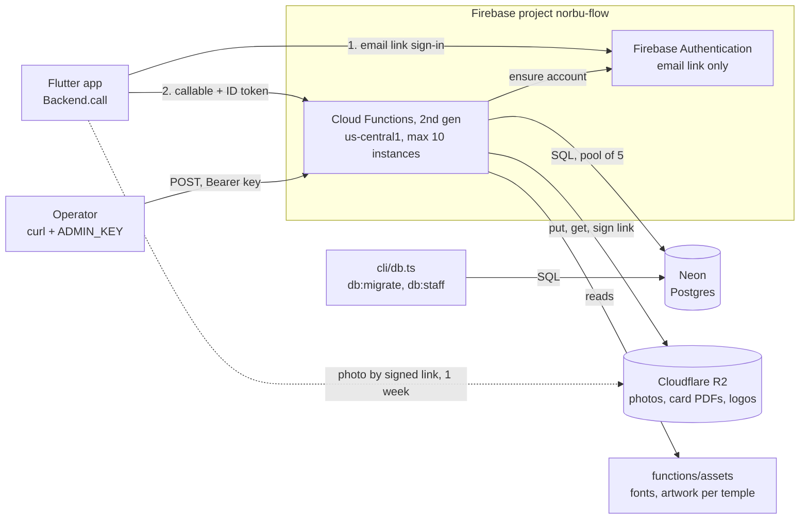
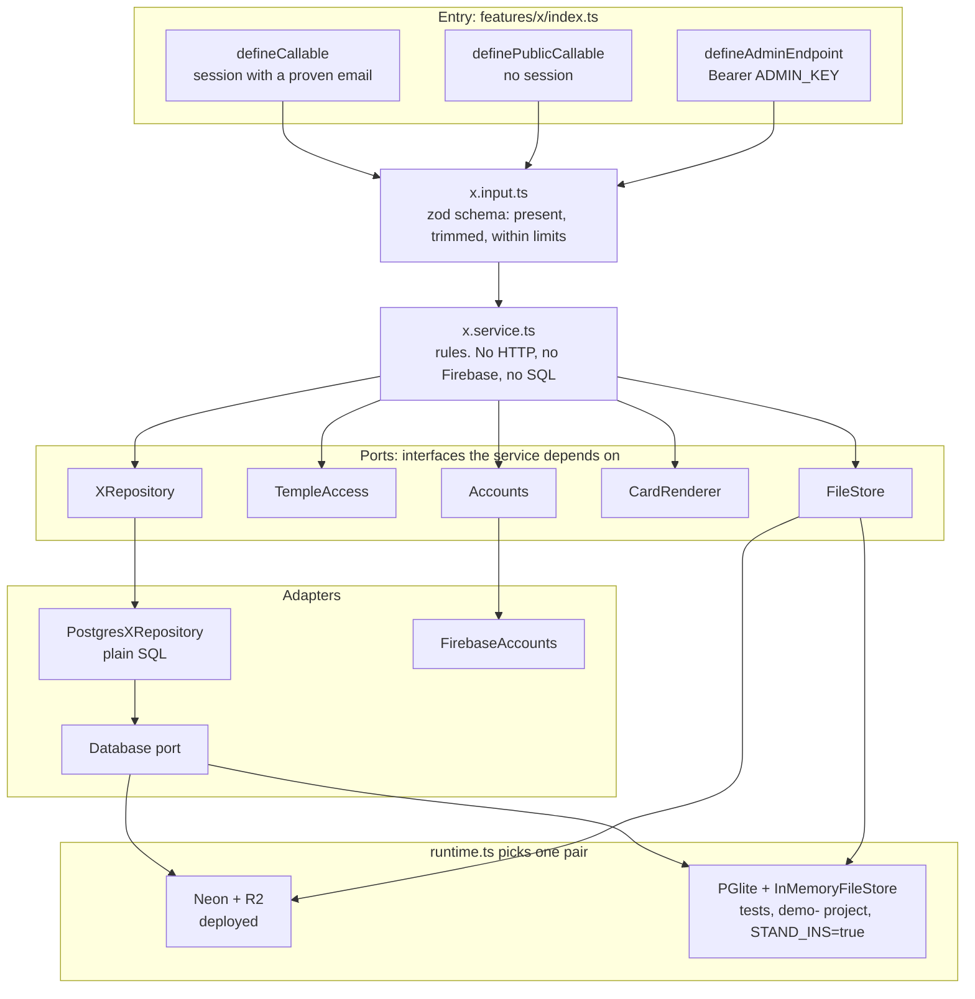
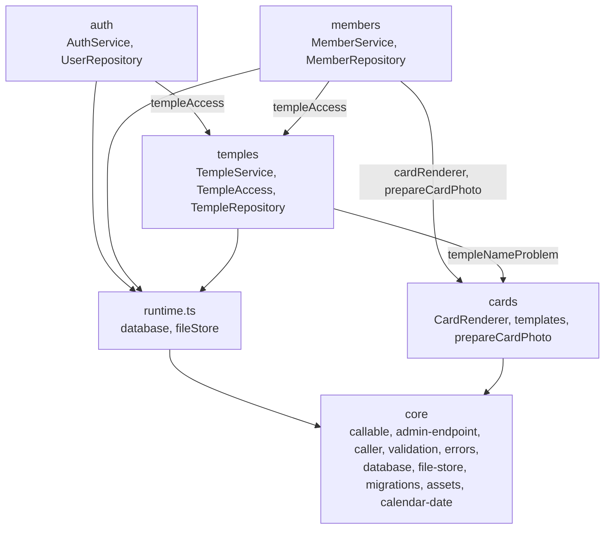
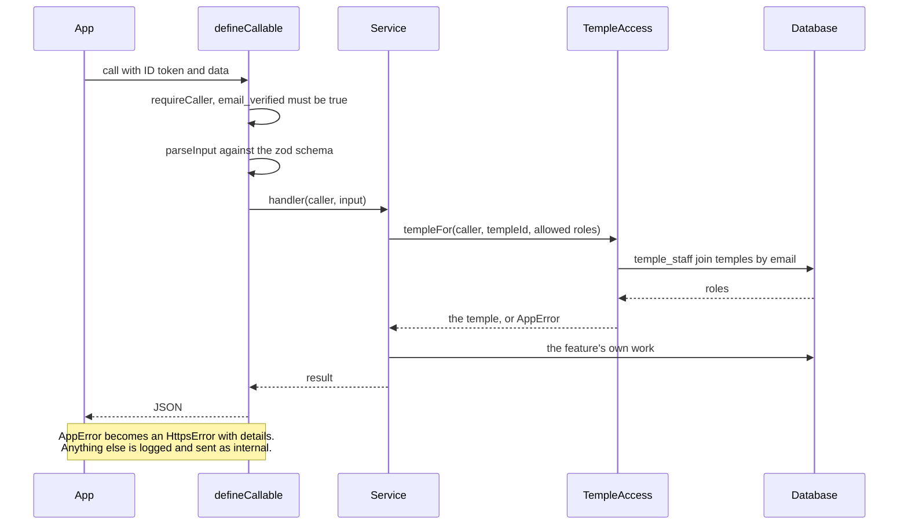
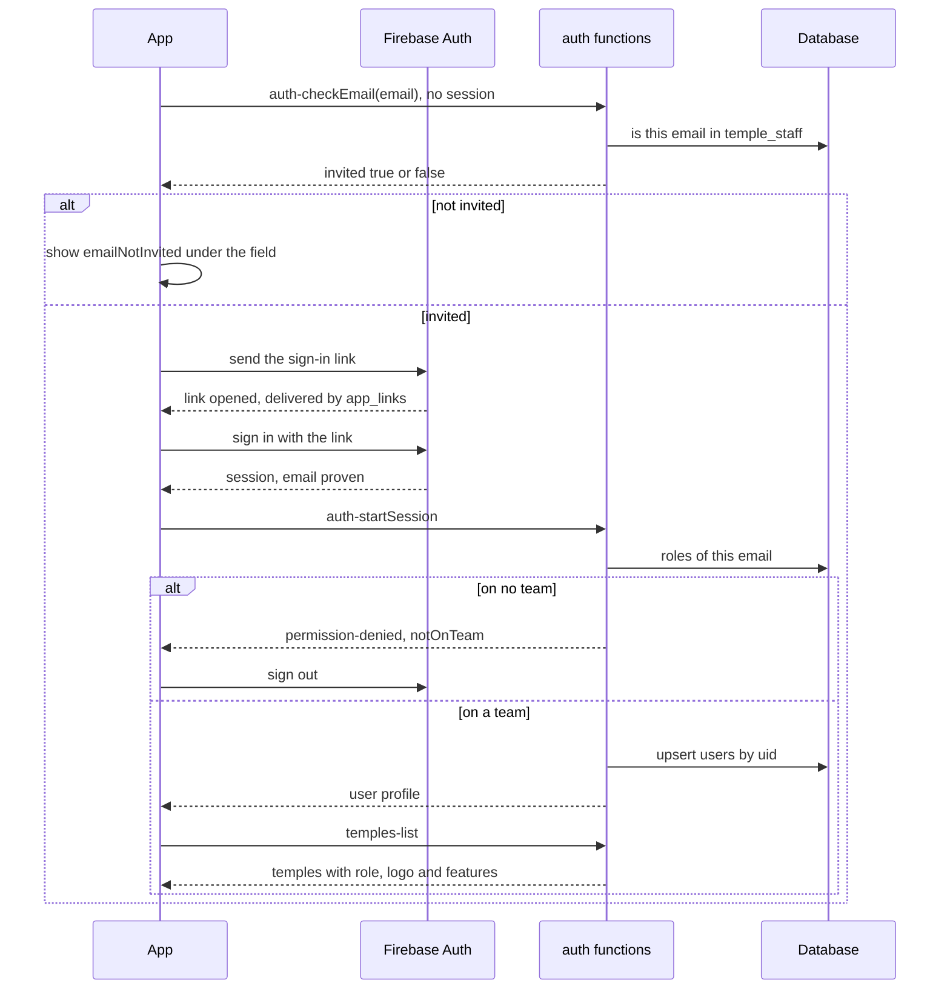
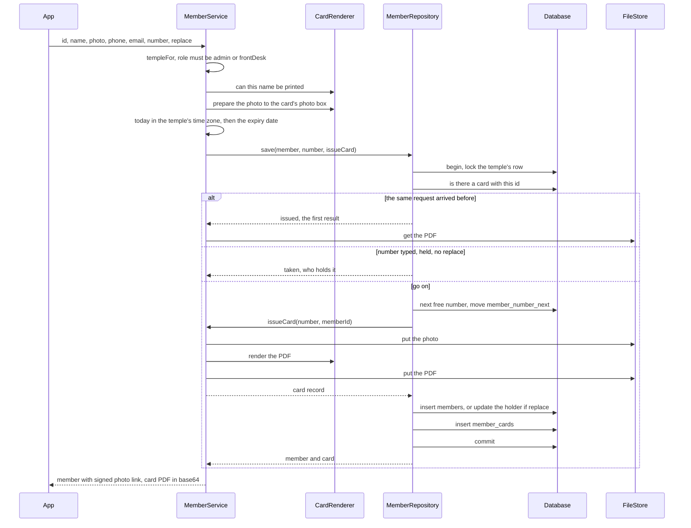
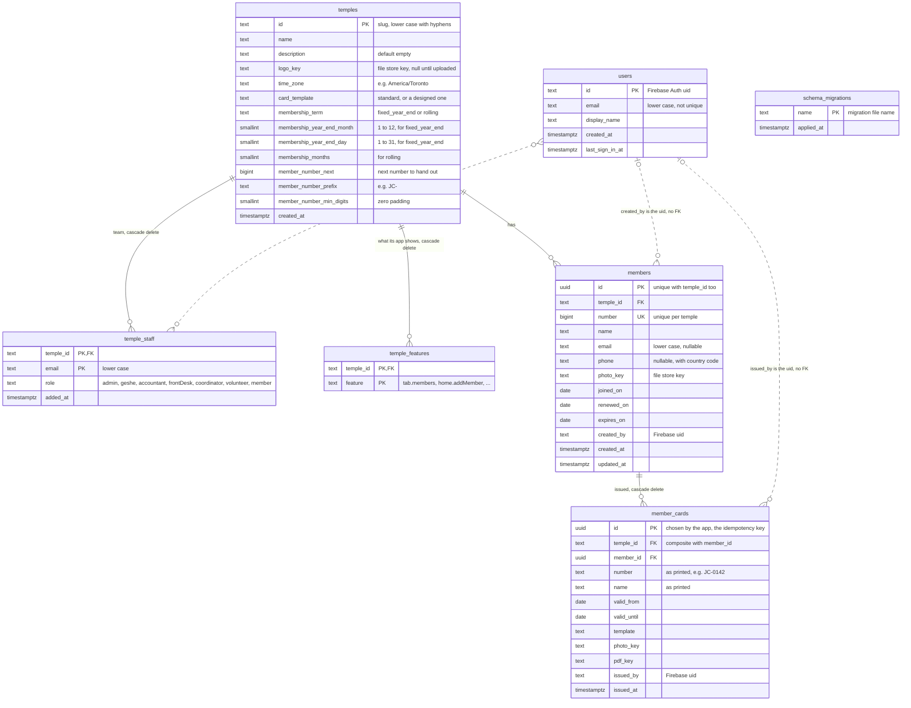

# Backend architecture

How the `functions/` backend is put together, how a request moves through it,
and what the database looks like. The diagrams are Mermaid: GitHub renders
them, and so does VS Code with a Mermaid preview extension.

Drawn from the code as of migration `003_temple_profile.sql`.

## 1. The system



- The app never talks to Neon or R2 with credentials of its own. It gets a
  member's photo as a link the backend signed.
- `functions/.env` holds `DATABASE_URL`, the `R2_*` settings and `ADMIN_KEY`.

## 2. The functions

| Function | Kind | Who may call | What it does |
| --- | --- | --- | --- |
| `auth-checkEmail` | public callable | anyone | Says whether an email is on some temple's team. Yes or no only. |
| `auth-startSession` | callable | on a team | Upserts the `users` row, returns the profile. |
| `temples-list` | callable | on a team | The caller's temples, with role, logo and what each shows. |
| `temples-create` | admin endpoint | operator | Registers a temple. |
| `temples-setLogo` | admin endpoint | operator | Stores a logo under a new key. |
| `temples-addAdmin` | admin endpoint | operator | Puts an email on the team, ensures a Firebase account. |
| `temples-setFeatures` | admin endpoint | operator | Replaces the tabs and Home cards the temple's app shows. |
| `members-list` | callable | admin, geshe, accountant, frontDesk, coordinator | The temple's members, newest first. |
| `members-card` | callable | same as list | A member and the PDF of the card they hold. |
| `members-preview` | callable, 1 GiB | admin, frontDesk | Draws the card. Saves nothing. |
| `members-create` | callable, 1 GiB | admin, frontDesk | Adds a member, issues their card. |
| `members-update` | callable, 1 GiB | admin, frontDesk | Changes a member, reissues the card if it shows the change. |

`cards` has no functions: it is the renderer the others use.

## 3. Layers inside a feature



Each feature's `index.ts` builds its service once, lazily, on the first call.
Heavy libraries (`pg`, the S3 client, `sharp`, `pdf-lib`) are imported where
they are used, so functions that do not need them start fast.

## 4. How the features depend on each other



`TempleAccess` is the one place that decides who may do what. It reads
`temple_staff` by the caller's email, so the team list is also the sign-in
invitation list.

## 5. One callable request



| `AppError` kind | Callable code | Admin endpoint status |
| --- | --- | --- |
| `unauthenticated` | `unauthenticated` | 401 |
| `permissionDenied` | `permission-denied` | 403 |
| `invalid` | `invalid-argument` | 400 |
| `notFound` | `not-found` | 404 |
| `conflict` | `already-exists` | 409 |
| anything else | `internal` | 500 |

`details.reason` and the values of `details.fields` are names of the app's
enums (`PermissionReason`, `ConflictReason`, `ValidationIssue`).

## 6. Sign-in



## 7. Adding a member (`members-create`)



- The lock on the temple's row is what stops two requests getting the same
  number, and what makes a retry wait for the first attempt's result.
- A typed number skips the counter: it is used as it is, and the counter
  steps over it when it gets there.
- `members-update` takes the same lock. It prints a new card only when the
  name, the photo or the number changed. An edit may not take a held number.
- `members-preview` runs the same checks and the same renderer with no
  transaction and no writes.

## 8. Database schema



### Keys, constraints and indexes

| Table | Constraint or index | Why |
| --- | --- | --- |
| `temples` | check on `id` format | Ids are URL-safe slugs. |
| `temples` | check: the columns each `membership_term` needs are set | The repository can trust them. |
| `users` | index `users_by_email (email)` | Email is not unique: a remade account has a new uid. |
| `temple_staff` | primary key `(temple_id, email)` | One role per person per temple. |
| `temple_staff` | index `temple_staff_by_email (email)` | Sign-in and access look up by email. |
| `temple_features` | primary key `(temple_id, feature)` | A tab or card is on once per temple. |
| `members` | unique `(temple_id, number)` | A number is held by one member of a temple. |
| `members` | unique `(temple_id, id)` | Target of the composite foreign key below. |
| `members` | index `members_by_name (temple_id, lower(name))` | Search by name. |
| `members` | index `members_by_expiry (temple_id, expires_on)` | Who is due. |
| `member_cards` | foreign key `(temple_id, member_id)` to `members (temple_id, id)` | A card can only point at a member of its own temple. |
| `member_cards` | index `member_cards_by_member (temple_id, member_id, issued_at desc)` | The card a member holds is their newest. |

### What the schema means

- **A temple is the tenant.** Every temple-owned table has `temple_id`, its
  indexes lead with it, and every query filters on it.
- **`members` is today, `member_cards` is history.** A member's row changes;
  a card row never does. A reprint or a changed name adds a card.
- **The card a member holds** is their row in `member_cards` with the latest
  `issued_at`. The code always inserts one with a new member.
- **`members.number` is digits only.** The prefix and padding on the `temples`
  row turn it into what is printed, which `member_cards.number` keeps.
- **`users` is a profile, not a permission.** Access comes from
  `temple_staff`, matched on email.
- **A row in `temple_features` means on.** No row, not shown. Home and More
  are always shown, so they have no names.
- Only `auth`, `temples` and `members` have tables so far. Offerings,
  volunteers, announcements and the rest are still fakes in the app.

## 9. Files in R2

```
temples/<temple id>/
  logo-<uuid>.png                         a new key each time it is replaced
  members/<member id>/cards/<card id>.jpg the photo on that card
  members/<member id>/cards/<card id>.pdf the card as printed, front then back
```

The database stores only these keys (`temples.logo_key`, `members.photo_key`,
`member_cards.photo_key`, `member_cards.pdf_key`).
